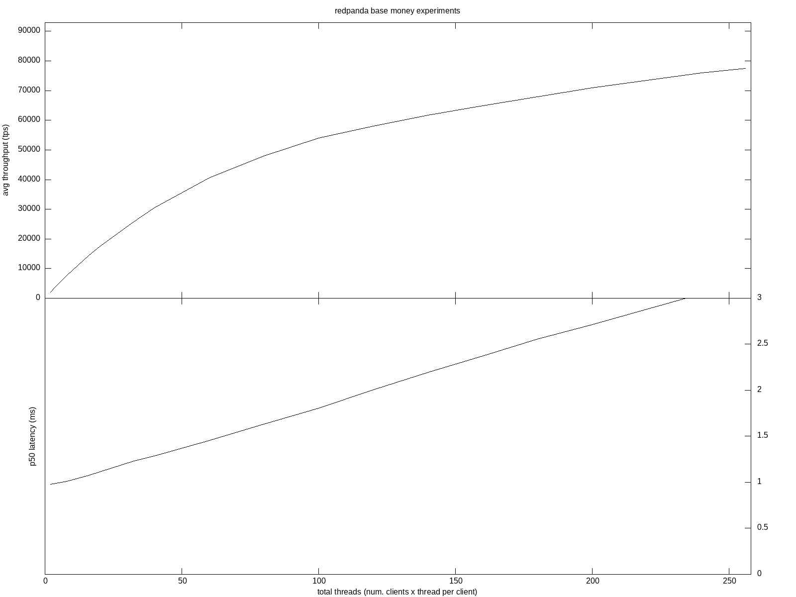
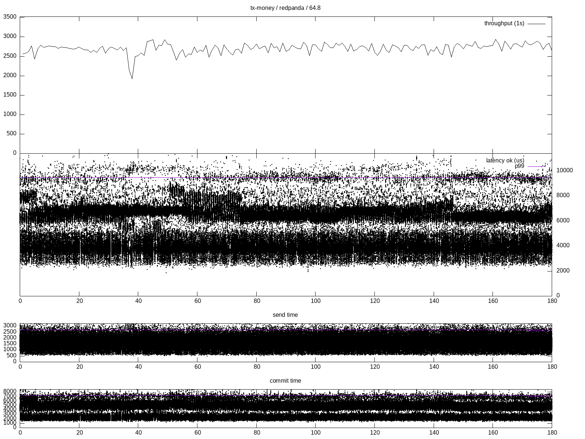
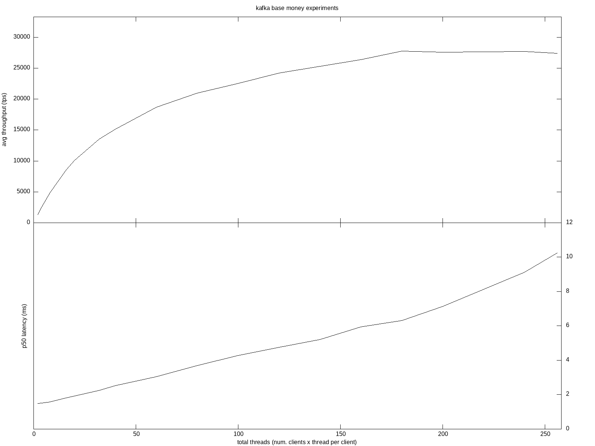
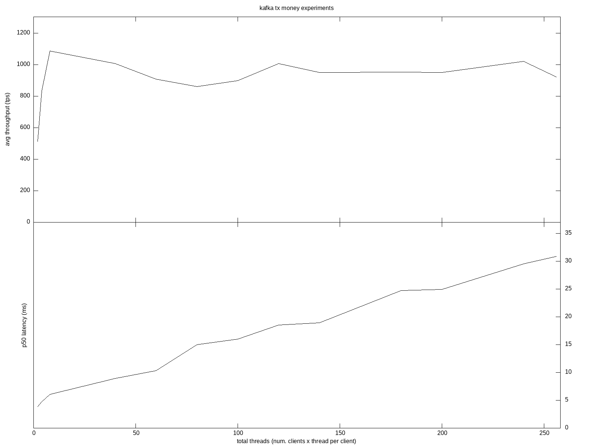
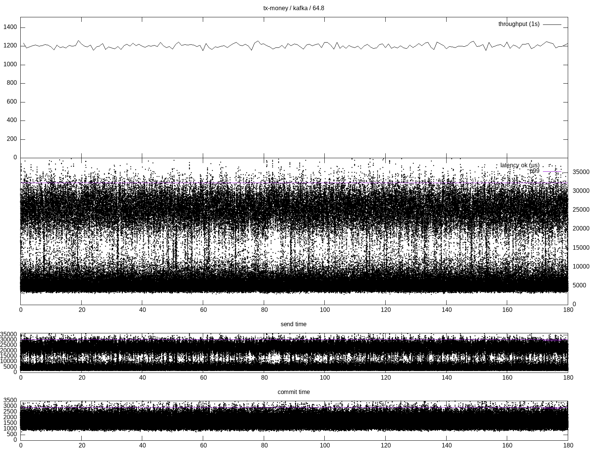

# How to use tx perf testing
 
Set `DEB_PATH` with path to the redpanda deb package (build redpanda with `task rp:build` then assemble .deb package with `task rp:build-pkg PKG_FORMATS=deb`; usually it is assembled to `vbuild/release/clang/dist/debian/redpanda_0.0-dev-0000000_amd64.deb`)
 
## Test on AWS (terraform & ansible)
 
Requirements:
- terraform
- ansible
- python3
- gnuplot
- pip3 install sh pyyaml
 
All in one script: `./playbooks/test.all.sh`
 
It:
 - uses terraform to provision:
   - 3 `i3en.6xlarge` nodes to host Redpanda or Kafka cluster
   - 2 `i3.8xlarge` nodes to host clients and generate load
   - 1 `i3.large` control node to orchestrate the experiments
 - uses ansible to deploy Redpanda, Kafka and client code to the nodes
 - execute the experiments and download data
 
The experiment evaluates scalability of the cross partition transactions by number of clients. A transaction sends two messages (1Kb each) to different partitions. There are two client hosts each hosting a single process with a variable number of threads. A thread uses its own Kafka client and executes transactions in a closed loop.
 
Once the experiments are over you'll find the logs in the `results` folder:
 
 - `results/tx-money-redpanda-64`
 - `results/tx-money-kafka-64`
 - `results/base-money-redpanda-64`
 - `results/base-money-kafka-64`
 
`64` suffix means that overall there were 64 partitions and each transaction was choosing two randomly to perform the operation. `money` is the name of the experiment (writing to two partitions corresponds to the classical money transfer transactional example). `tx` or `base` means whether or not the experiment uses transactions. We use non-transactional workload to estimate the overhead/cost of transactions.
 
Each directory contains a `latest.json` file with a list of the performed experiments:
 
```
{
 "test_runs": {
   "tx-money / redpanda / 64.1": {
     "1644251804": "PASSED"
   },
   "tx-money / redpanda / 64.2": {
     "1644252138": "PASSED"
   },
   ...
   "tx-money / redpanda / 64.128": {
     "1644257124": "PASSED"
   }
 },
 "name": "all",
 "result": "PASSED",
 "run_id": "1644251804"
}
```
 
The `.1`, `.2`, `.128` etc mean how many threads each client process used.
 
Use `python3 harness/analyze.py $(pwd)/results/tx-money-redpanda-64/latest.json` command to build charts for each of the experiment. The output is located in the folder corresponding to the experiment
 
Use `python3 harness/overview_money.py --title "redpanda tx money experiments" --path $(pwd)/results/tx-money-redpanda-64` to aggregate the charts into one.
 
# Results
 
## Redpanda
 
### Send two messages 1Kb each to two partitions without transactions
 

 
### Send two messages 1Kb each to two partitions with transactions
 

 
#### Single experiment (8 threads x 2 processes)
 

 
## Kafka
 
### Send two messages 1Kb each to two partitions without transactions
 

 
### Send two messages 1Kb each to two partitions with transactions
 

 
#### Single experiment (8 threads x 2 processes)
 
